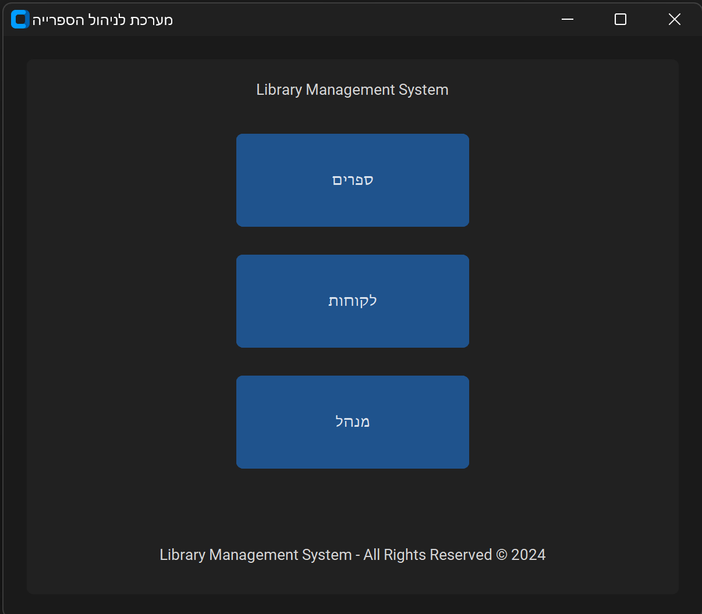
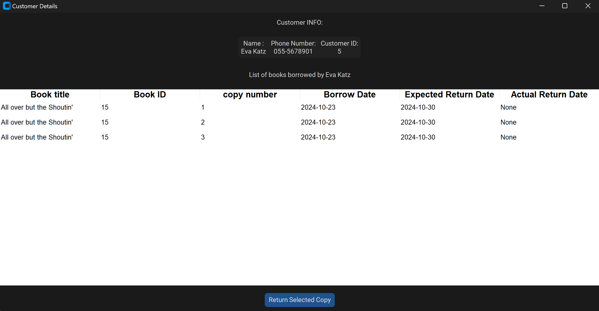

# Library Management System

## Summary

The **Library Management System** is a comprehensive application designed to facilitate the management of library operations. 
It offers features for **customer management**, **book management**, **borrowing activities**, and **book copies inventory**. 
This project aims to streamline the process of tracking and managing library resources, making it easier for librarians and customers to interact with the system.

## Features
- **Customer Management**: Efficiently manage customer information and interactions.
- **Book Management**: Organize and maintain a catalog of available books.
- **Manage Borrowing Activities**: Track the borrowing process, including expected and actual return dates.
- **Manage Book Copies Inventory**: Monitor the availability and inventory of book copies.

## Technologies Used

This project utilizes the following technologies:

- **Python**: The primary programming language used to develop the application.
- **MySQL**: A relational database management system used to store and manage library data.
- **CustomTkinter**: A modernized version of Tkinter used for creating the graphical user interface (GUI).
- **tkcalendar**: A calendar widget for selecting dates within the GUI.
- **Matplotlib**: A plotting library for creating visualizations, such as pie charts for statistical data.

## Installation Requirements

To set up the project, ensure you have Python installed on your machine. You will also need to install the following packages:

1. CustomTkinter
2. MySQL Connector
3. tkcalendar
4. Matplotlib

You can install these packages using pip. Open your terminal or command prompt and run:

```bash
pip install customtkinter mysql-connector-python tkcalendar matplotlib
```

## Database Setup and Configuration

To set up the database for the Library Management System, follow these steps:

1. **Database Configuration**:
   - Locate the `db_credentials.ini` file in the project directory.
   - Update the following details under the `[mysql]` section:
     ```ini
     host = <your_database_host>
     user = <your_database_user>
     password = <your_database_password>
     database = <your_database_name>
     ```

2. **Database Initialization**:
   - Run the `initialize_library_database.sql` file to create the necessary tables and load data.
   - Make sure to update the path to the CSV file in the SQL script to match your system's directory. The relevant line in `initialize_library_database.sql` is as follows:
     ```sql
     -- Load data from the CSV file into the books table
     LOAD DATA INFILE 'C:/Path/To/Your/BooksDatasetClean.csv'

     ```
   - Replace `'C:/Path/To/Your/BooksDatasetClean.csv'` with the actual path to your `BooksDatasetClean.csv` file.

3. **Run the SQL Script**:
   - You can execute the SQL script using a MySQL client or an IDE like MySQL Workbench to create the database structure and populate it with initial data.


## Running the Application
To run the application:
1. Open the project in **PyCharm** or any preferred IDE.
2. Ensure that all required dependencies are installed and the database is properly configured.
3. Run the main application script.

## Screenshots

*Main window of the Library Management System.*


*Books management interface.*


*Customer management interface.*


*Borrowing management interface.*


*Customer info interface.*


*Manager interface.*